# Health Report: Period 1 vs Period 2

140 days of wearable data (Zepp / Mi Band), **2026-05-12 to 2026-09-28**, split by export:

- **P1:** 12 May – 20 Jul 2026 (70 days)
- **P2:** 21 Jul – 28 Sep 2026 (70 days)

All times are **IST (UTC+5:30)**. Charts and statistics are generated by [`scripts/build_report.py`](../scripts/build_report.py).

---

## Summary

| | What changed from P1 to P2 | Confidence |
|---|---|---|
| 🕐 **Sleep timing** | Fell asleep at 01:38 instead of 03:21, woke at 07:54 instead of 10:28. Wake-up time also became more regular. | Very strong (p < 0.001) |
| 😴 **Sleep length** | 6.55 h → 6.04 h a night. Nights under 6 h rose from 23 to 36, over half of P2. REM fell by 12 min a night. | Moderate (p ≈ 0.03) |
| ❤️ **Heart rate** | All-day average down 2.9 bpm (65.0 → 62.1). Resting and sleeping HR down about 1 bpm. | Strong for all-day HR (p = 0.004); borderline for resting HR |
| 🏃 **Running fitness** | 8% more distance per heartbeat. At the same distances you ran up to 1 min/km faster, at a similar or lower heart rate. | Suggestive (small sample: 21 runs) |
| 🏋️ **Training mix** | More indoor high-intensity work (HIIT sessions doubled, and a new code-191 session started on 19 Aug). Less running and strength. Total training time unchanged. | Descriptive |
| 👟 **Steps and energy** | Unchanged: about 7,850 steps and about 2,300 kcal burned a day. | No real change |

**The big picture.** Your cardio fitness improved a little. Your sleep schedule moved about two hours earlier and became more regular. But your wake-up moved further than your bedtime, so the average night got **30 minutes shorter**. Sleep length is now the weakest part of the data.

**Correction to the earlier analysis.** `ANALYSIS.md` originally said that busy days cut into that night's sleep. With each day correctly paired with the night *after* it, that link is not there (ρ = +0.10, not significant). The pattern that is there runs the other way: **short nights come before busy days** (ρ = −0.35, p < 0.001). That points to early starts, not activity costing sleep.

---

## How to read this report

- **Comparisons (P1 vs P2).** For each daily metric there are two tests:
  - Welch's t-test compares averages.
  - The Mann-Whitney test compares distributions; it's the safer test here because most metrics are skewed.
  - Cohen's *d* is the effect size: about 0.2 is small, 0.5 medium, 0.8 large.
- **Trends.** A straight-line fit over all 140 days, reported as change per 30 days.
- **Relationships.** Spearman correlation (ρ) between each day's activity and the night that follows it. This tests "activity affects sleep", not "sleep and activity happen on the same date".
- **Be careful with p-values.**
  - Neighbouring days are correlated, so the p-values are somewhat optimistic.
  - About 23 daily metrics were tested, so roughly one could look significant by chance.
  - Only the sleep-timing shift clears a strict correction for that (Bonferroni, p < 0.002). All-day HR (p = 0.004) comes close.
- **Resting HR** is the day's lowest auto reading. **Sleeping HR** is the night's average from the minute-level sleep file. There is no dedicated resting-HR field in the export.
- **Vigorous minutes** are minutes with HR ≥ 140 bpm (70% of the age-predicted maximum of 200).

---

## 1. Activity

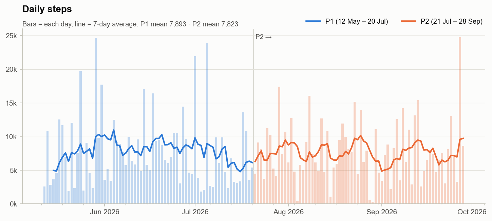

- **Steps held steady:** 7,893 → 7,823 a day (p = 0.54). There's no trend over the 140 days, and the 7-day average stayed between about 5k and 10k throughout.
- **More movement minutes, same steps:** active minutes rose slightly (149 → 158 a day, not significant). The median day got more active (6,496 → 7,382 steps); P1 had more very low and very high days.

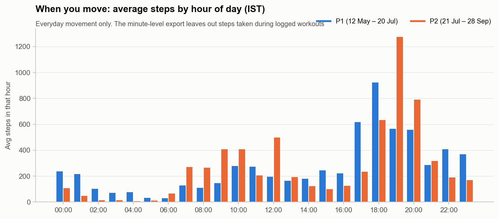

- **Your day starts earlier.** In P2 there is real movement from 07:00–12:00. In P1 the mornings were nearly empty, and there was more walking after 22:00.
- **The evening peak moved later,** from 18:00 to 19:00, which lines up with the new 19:00 training sessions.
- This chart only counts everyday movement: the minute-level step file leaves out steps taken during logged workouts.

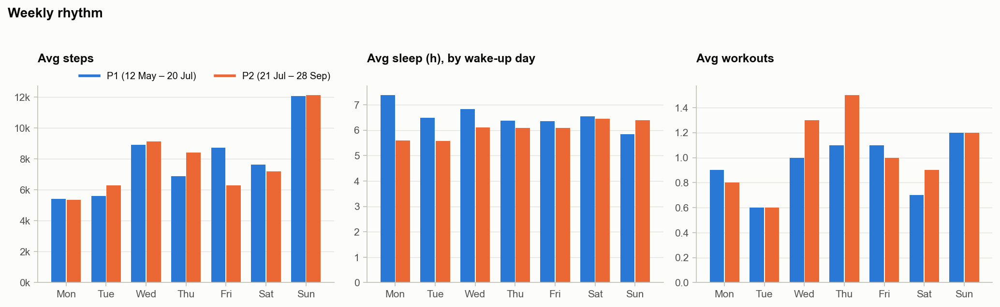

- **Sunday is by far the biggest step day** in both periods (about 12,100 steps).
- **Monday and Tuesday nights are now the shortest:** 5.6 h in P2, versus 7.4 h on Monday in P1. That suggests an early start at the beginning of the week.
- **Training moved towards midweek:** Wednesday and Thursday averaged 1.3–1.5 workouts a day in P2.

---

## 2. Heart rate and fitness

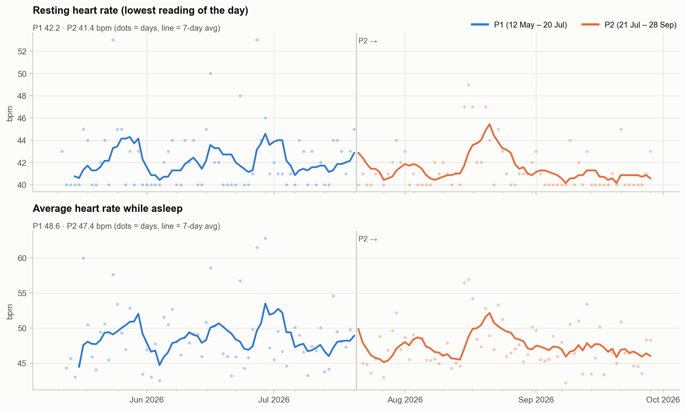

| | P1 | P2 | Change | p (Welch / Mann-Whitney) | d |
|---|---|---|---|---|---|
| Resting HR (daily low) | 42.2 | 41.4 | −0.8 | 0.055 / 0.123 | −0.33 |
| Sleeping HR (night average) | 48.6 | 47.4 | −1.2 | 0.077 / 0.158 | −0.32 |
| Lowest 10-min sleeping HR | 44.3 | 43.4 | −1.0 | 0.119 / 0.260 | −0.28 |
| **All-day average HR** | **65.0** | **62.1** | **−2.9** | **0.004 / 0.007** | **−0.49** |

- **Every heart-rate measure moved down,** and all-day HR has a clear downward trend (−1.1 bpm per 30 days, p = 0.005). Resting HR in the low 40s was already very low.
- **Two spikes stand out:** early July in P1 and mid-August in P2. Both came during heavy training weeks. The mid-August one is the week of 17 Aug (9 sessions, 245 vigorous minutes).
- **The last month of P2 is the calmest stretch in the data:** the 7-day average sleeping HR stayed around 46–47 bpm.

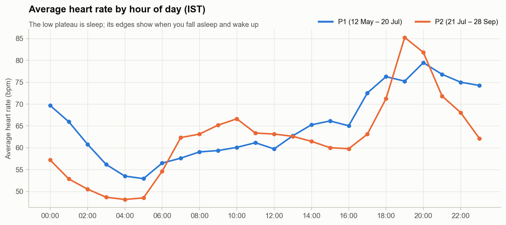

- **The overnight low is deeper and earlier in P2:** about 48 bpm at 04:00–05:00, versus 53 bpm in P1. In P1 you were often still awake at 01:00 with HR around 66–70.
- **The P2 evening peak (85 bpm at 19:00)** comes from the evening training block.

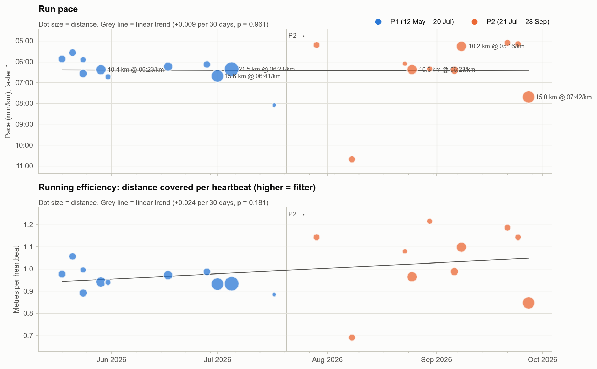

The average pace looks flat (6:25 vs 6:26 per km), but only because P2 mixes very different runs: a 10:41/km run-walk on 8 Aug, and a slow 15 km on 27 Sep. Compared like for like:

| Run | P1 | P2 |
|---|---|---|
| ~10 km | 10.4 km at 6:23/km, HR 166 (29 May) | 10.3 km at 6:23/km, **HR 162** (25 Aug) 10.2 km at **5:16/km**, HR 173 (8 Sep) |
| ~4–5 km | 5.1–5.3 km at 5:34–5:52/km, HR 170–174 | 3.8–4.2 km at **5:05–5:12/km, HR 165–170** |
| 15 km+ | 15.6 km at 6:41/km, HR 160 (1 Jul) | 15.0 km at 7:42/km, HR 153 (27 Sep) |

- **Running efficiency** (metres covered per heartbeat) rose from 0.956 to 1.036 (+8%, d = +0.67, Mann-Whitney p = 0.07).
- **Average HR on runs** fell from 164 to 157 bpm.
- **Short and 10 km runs are clearly faster** at a similar or lower heart rate. That is what improved aerobic fitness looks like.
- **The one long P2 run was slower,** consistent with running volume dropping by a quarter (84.7 → 63.6 km).

---

## 3. Training

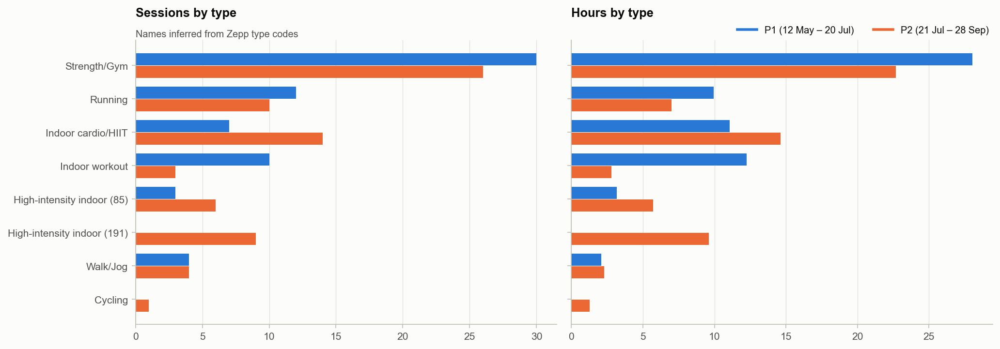

| Type | Sessions P1 → P2 | Avg HR P1 → P2 | kcal/min P1 → P2 |
|---|---|---|---|
| Strength/Gym | 30 → 26 | 96 → 88 | 4.6 → 3.5 |
| Running | 12 → 10 | 162 → 157 | 11.5 → 11.2 |
| Indoor cardio/HIIT | 7 → **14** | 149 → 147 | 10.7 → 10.6 |
| High-intensity indoor (191) | 0 → **9** | – → 150 | – → **10.9** |
| High-intensity indoor (85) | 3 → 6 | 139 → 130 | 9.6 → 8.7 |
| Indoor workout | 10 → 3 | 108 → 108 | 5.9 → 5.9 |

- **P2 swapped low-intensity indoor sessions for high-intensity ones.** Code 191 (about an hour at ~150 bpm, ~650 kcal) became your most demanding regular session.
- **Strength sessions got calmer** (lower HR and kcal/min). That usually means longer rests or heavier, lower-rep lifting, but the data can't tell which.

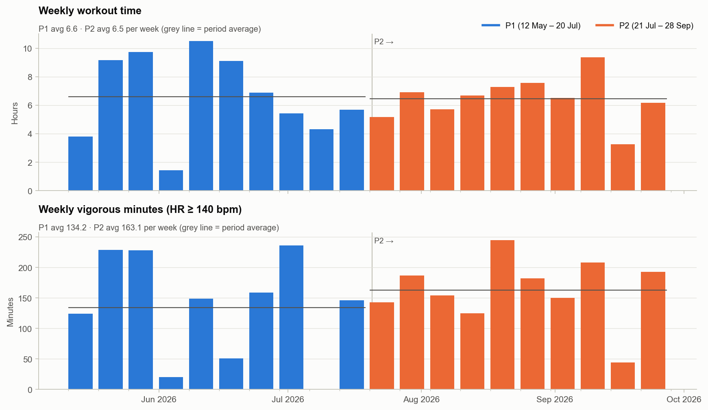

- **Training time was flat** (about 6.6 h a week in P1 vs 6.5 h in P2), but it was more consistent in P2. P1 swung between 1.4 h and 10.5 h a week.
- **Vigorous minutes rose** from 134 to 163 a week, with no near-zero weeks except 14 Sep.

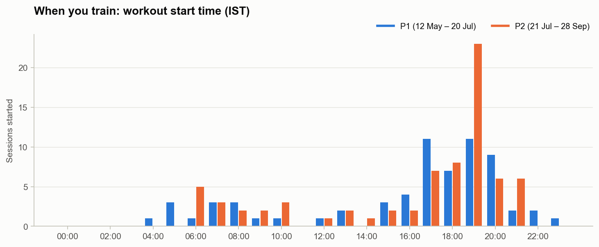

- **Training moved into one evening slot:** the median start went from 17:00 to 18:00, and 23 of P2's 73 sessions started in the 19:00 hour.
- **Morning sessions (06:00–10:00)** appear in both periods; these are mostly runs.

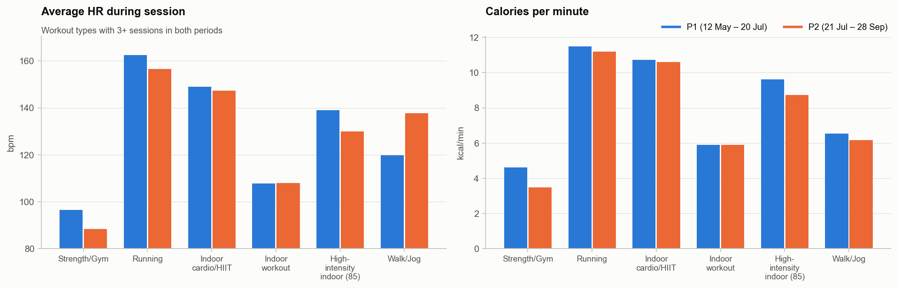

---

## 4. Sleep

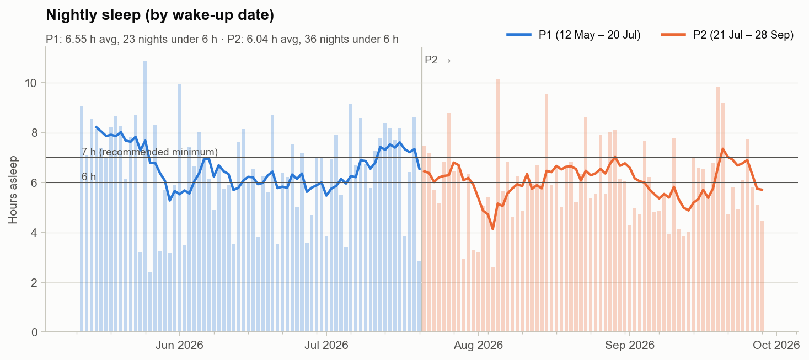

| | P1 | P2 | Change | p (Welch / Mann-Whitney) | d |
|---|---|---|---|---|---|
| Sleep (h) | 6.55 (median 6.84) | 6.04 (median 5.96) | −0.50 | 0.093 / **0.028** | −0.29 |
| Nights under 6 h | 23 | **36** | +13 | – | – |
| Deep (min) | 68 | 64 | −4 | 0.176 / 0.234 | −0.23 |
| Light (min) | 231 | 217 | −14 | 0.239 / 0.117 | −0.20 |
| **REM (min)** | **93** | **81** | **−12** | **0.031 / 0.027** | **−0.37** |
| Awake in bed (min) | 13.4 | 13.0 | −0.5 | 0.912 / 0.012 | −0.02 |

- **Worst weeks:** 27 Jul (4.9 h a night) and 7 Sep (4.9 h a night). The 7 Sep week was also P2's heaviest training week (about 620 kcal a day of workouts).
- **Best weeks** were the lightest training weeks: 6 Jul (7.4 h) and 14 Sep (7.4 h). The 14 Sep week also had the lowest resting HR (40.1) and sleeping HR (45.8) in the data. Rest weeks show up clearly as recovery.

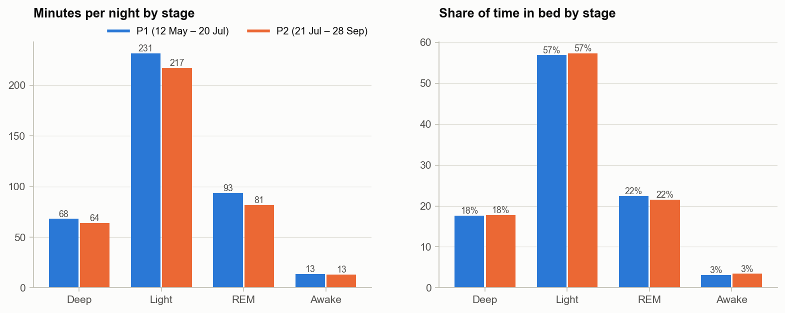

- **Sleep structure is unchanged.** Deep sleep is about 18% and REM about 22% of the night in both periods, which is a normal pattern.
- **REM fell because the night got shorter.** REM comes mostly late in the night, so a cut-short morning removes it first.

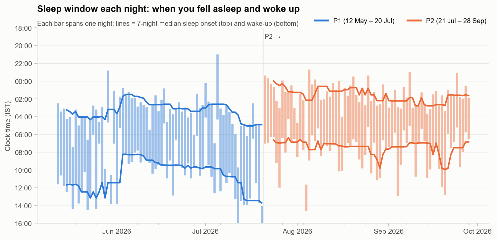

| | P1 | P2 | Change | p | d |
|---|---|---|---|---|---|
| Fell asleep | 03:21 | **01:38** | −1 h 42 | < 0.001 | −0.74 |
| Woke up | 10:28 | **07:54** | −2 h 33 | < 0.001 | −1.00 |
| Bedtime variability (SD) | 2.8 h | 1.8 h | more regular | Levene 0.068 | – |
| Wake-up variability (SD) | 3.0 h | 2.1 h | **more regular** | Levene **0.011** | – |

This is the strongest result in the data. The whole sleep window moved earlier, but **the wake-up moved about 50 minutes further than the bedtime**, and that is where the lost sleep went. The pattern looks like a fixed morning commitment that started in late July. The 7-night median wake-up stays at about 07:00–07:30 on most P2 weeks.

---

## 5. How things connect

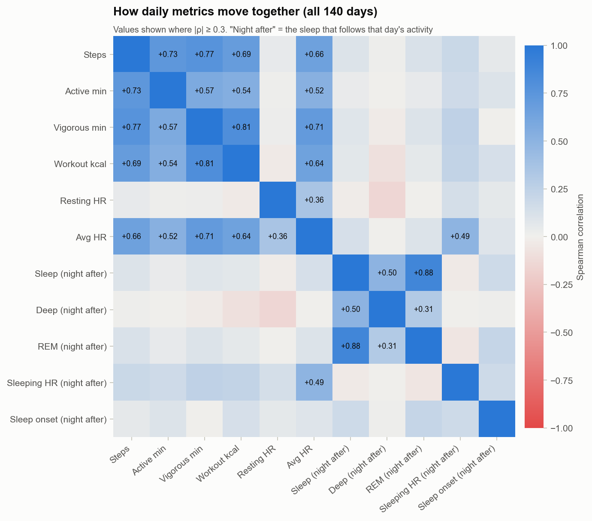

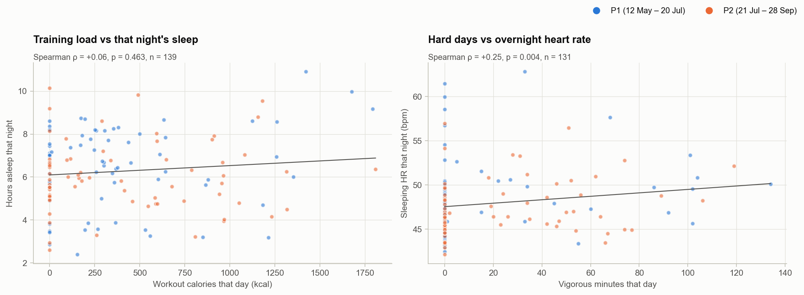

| Relationship (Spearman ρ, all 140 days) | ρ | p | Reading |
|---|---|---|---|
| Workout calories today → sleep tonight | +0.06 | 0.46 | **No effect.** Training doesn't cost you sleep. |
| Steps today → sleep tonight | +0.10 | 0.26 | No effect |
| **Vigorous minutes today → sleeping HR tonight** | **+0.25** | **0.004** | Hard days raise your overnight heart rate. Same size in both periods. |
| Workout calories today → sleeping HR tonight | +0.23 | 0.008 | Same pattern |
| **Sleep last night → steps today** | **−0.35** | **< 0.001** | Short nights come before busy days (early starts) |
| Sleep last night → workout calories today | −0.21 | 0.015 | Same pattern, weaker |
| Sleep last night → resting HR today | −0.18 | 0.038 | Short sleep slightly raises the next day's resting HR |
| All-day HR → sleeping HR that night | +0.49 | – | A high-strain day carries into the night |

**What this means in practice:**
- **Training doesn't cost you sleep.** Your schedule does: short nights are the ones before busy, early-start days.
- **A hard day shows up in that night's heart rate.** Hard days raise overnight HR by a few bpm. That's normal recovery load, and it disappears within a day or two.
- **Watch for back-to-back hard days with short sleep.** They stack both effects, and that's when the resting-HR spikes happen (for example 24 May: 3.2 h of sleep plus HIIT and two runs).

---

## 6. Energy expenditure

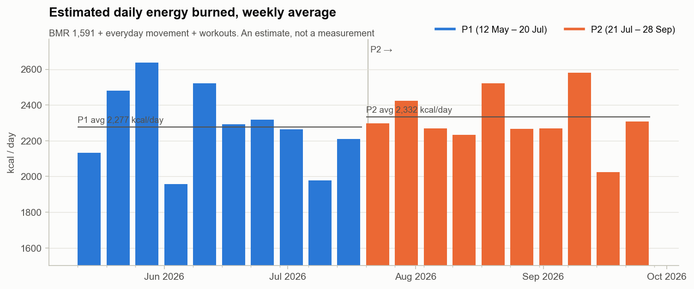

| | P1 | P2 |
|---|---|---|
| BMR (Katch-McArdle, 65 kg, 13% body fat) | 1,591 | 1,591 |
| Everyday movement (avg/day) | 276 | 310 |
| Workouts (avg/day) | 409 | 430 |
| **Mean total** | **2,277 kcal** | **2,332 kcal** |
| Median day | 2,112 kcal | 2,136 kcal |

Maintenance is about **2,100–2,350 kcal/day**, and the small rise in P2 (not significant) comes from the heavier indoor sessions. This is still an estimate: there is no food log and no real weight trend to check it against. See [ANALYSIS.md](../ANALYSIS.md) for the method.

---

## Full statistics (P1 vs P2, daily metrics)

| Metric | P1 mean (median) | P2 mean (median) | Change | p (Welch) | p (Mann-Whitney) | d | 140-day trend / 30 days (p) |
|---|---|---|---|---|---|---|---|
| Steps / day | 7,893 (6,496) | 7,823 (7,382) | −70 | 0.933 | 0.544 | −0.01 | −48 (0.878) |
| Distance / day (km) | 5.77 (4.53) | 5.69 (5.16) | −0.08 | 0.905 | 0.564 | −0.02 | −0.01 (0.959) |
| Active minutes / day | 149 (132) | 158 (153) | +9 | 0.512 | 0.302 | +0.11 | +1 (0.778) |
| Activity calories / day | 628 (474) | 647 (490) | +19 | 0.818 | 0.998 | +0.04 | −2 (0.939) |
| Resting HR, daily low (bpm) | 42.2 (41.0) | 41.4 (41.0) | −0.8 | 0.055 | 0.123 | −0.33 | −0.3 (0.074) |
| Sleeping HR, night avg (bpm) | 48.6 (47.7) | 47.4 (46.4) | −1.2 | 0.077 | 0.158 | −0.32 | −0.4 (0.099) |
| Lowest 10-min sleeping HR (bpm) | 44.3 (43.4) | 43.4 (42.7) | −1.0 | 0.119 | 0.260 | −0.28 | −0.4 (0.093) |
| All-day avg HR (bpm) | 65.0 (63.6) | 62.1 (61.9) | −2.9 | 0.004 | 0.007 | −0.49 | −1.1 (0.005) |
| Daily max HR (bpm) | 139 (128) | 142 (137) | +3 | 0.589 | 0.715 | +0.09 | +1 (0.775) |
| Vigorous minutes (HR ≥ 140) | 19.2 (0.0) | 24.0 (0.0) | +4.8 | 0.388 | 0.109 | +0.15 | +1.1 (0.582) |
| Workouts / day | 0.94 (1.00) | 1.04 (1.00) | +0.10 | 0.490 | 0.573 | +0.12 | +0.00 (0.980) |
| Workout minutes / day | 57 (59) | 57 (50) | −1 | 0.949 | 0.904 | −0.01 | −1 (0.811) |
| Workout calories / day | 396 (277) | 430 (275) | +34 | 0.655 | 0.892 | +0.08 | +4 (0.892) |
| Sleep (h) | 6.55 (6.84) | 6.04 (5.96) | −0.50 | 0.093 | 0.028 | −0.29 | −0.20 (0.070) |
| Deep sleep (min) | 68 (64) | 64 (66) | −4 | 0.176 | 0.234 | −0.23 | −1 (0.248) |
| Light sleep (min) | 231 (242) | 217 (215) | −14 | 0.239 | 0.117 | −0.20 | −7 (0.132) |
| REM sleep (min) | 93 (98) | 81 (80) | −12 | 0.031 | 0.027 | −0.37 | −4 (0.047) |
| Awake in bed (min) | 13.4 (7.0) | 13.0 (9.0) | −0.5 | 0.912 | 0.012 | −0.02 | +1.2 (0.422) |
| Deep % of sleep | 18.1% (17.2%) | 18.4% (17.8%) | +0.2% | 0.810 | 0.663 | +0.04 | +0.2 pts (0.537) |
| REM % of sleep | 23.1% (23.4%) | 22.3% (22.4%) | −0.8% | 0.284 | 0.188 | −0.18 | −0.2 pts (0.423) |
| Fell asleep (IST) | 03:21 (03:09) | 01:38 (01:32) | −1 h 42 | < 0.001 | < 0.001 | −0.74 | −0 h 34 (< 0.001) |
| Woke up (IST) | 10:28 (10:35) | 07:54 (07:10) | −2 h 33 | < 0.001 | < 0.001 | −1.00 | −0 h 45 (< 0.001) |
| Est. energy burned (kcal/day) | 2,277 (2,112) | 2,332 (2,136) | +55 | 0.558 | 0.621 | +0.10 | +6 (0.855) |

| Session-level metric | P1 | P2 | n (P1/P2) | p (Mann-Whitney) | d |
|---|---|---|---|---|---|
| Run pace (min/km) | 6:25 | 6:26 | 11 / 10 | 0.379 | +0.02 |
| Run efficiency (m per heartbeat) | 0.956 | 1.036 | 11 / 10 | 0.073 | +0.67 |
| Run average HR | 164.2 | 156.5 | 11 / 10 | 0.149 | −0.63 |
| All sessions average HR | 119.4 | 123.6 | 65 / 73 | 0.801 | +0.14 |
| All sessions kcal/min | 7.09 | 7.54 | 65 / 73 | 0.818 | +0.12 |
| Session length (min) | 61 | 54 | 66 / 73 | 0.428 | −0.20 |

---

## What would sharpen the next report

- **Weigh in weekly,** same time of day. That turns the maintenance estimate into a real measurement and allows a body-composition trend.
- **Keep logging runs of repeated distances** (a regular 5 km and 10 km). Efficiency at a fixed distance is the cleanest fitness signal in this data.
- **Drop the next export into the repo as another `Health Data...` folder** and rerun `scripts/build_summary.py` and `scripts/build_report.py`. P3 then gets added to every chart and comparison automatically.

*This is an analysis of consumer wearable data, not medical advice. Wearable heart-rate and sleep-stage estimates have known error margins.*
